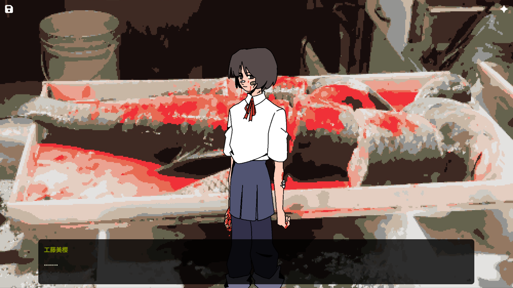
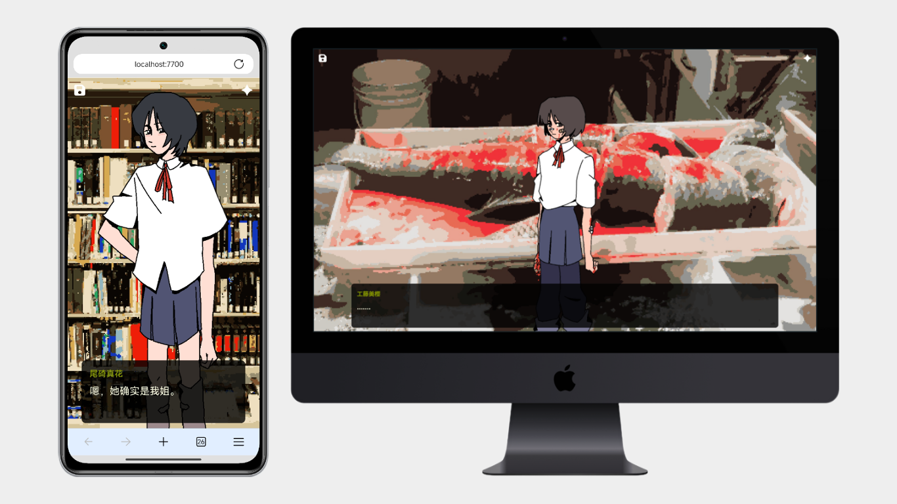

# Dvnge 视觉小说引擎

> **TTQWN工作室出品** | Web视觉小说引擎  
> **作者**：Tian | **联系方式**：TTQWNTian@qq.com

---

## 使用须知

> [!CAUTION]
> 使用前请仔细阅读许可证说明 → [LICENSE](LICENSE)

---
## 功能简介

Dvnge引擎是一款Web视觉小说开发框架，通过类JSON格式的章节数据驱动剧情发展，为开发者提供完整的视觉小说制作解决方案。

### 核心功能

| 功能模块 | 功能描述 |
| --- | --- |
| 多章节剧情 | 支持复杂的章节管理与剧情结构 |
| 对话系统 | 角色名与对话内容，支持逐字显示效果 |
| 立绘系统 | 左/中/右三位置角色立绘灵活控制，支持图片与视频 |
| 背景系统 | 支持纯色背景、图片背景或视频背景切换 |
| 分支选项 | 多样化选择支路设计，支持条件显示与变量设置 |
| 背景音乐 | BGM播放支持，切换时淡出 |
| 音效系统 | 音效与音乐可同时播放 |
| CG收集 | 剧情节点解锁CG，存储于本地 |

### 对话系统

- **逐字显示**：对话内容逐字打出，可调节显示速度
- **打字音效**：逐字显示时播放音效，可调节音量与间隔字符数
- **富文本格式**：对话框中支持 `<b>粗体</b>`、`<i>斜体</i>` 等HTML标记
- **变量插值**：在对话文本中使用 `{变量名}` 进行动态替换
- **头像系统**：支持左/右位置头像显示
- **角色样式配置**：不同角色可自定义名字显示样式

### 变量与逻辑

- **用户变量系统**：支持嵌套对象的灵活变量管理，数据持久化存储
- **条件分支**：基于变量值实现剧情分支，支持JavaScript表达式
- **数学运算**：变量支持 `+=`、`-=`、`*=`、`/=` 等运算符
- **变量插值**：在路径、立绘、背景中使用 `{变量名}` 进行动态替换
- **读档变量设置**：读档时自动设置指定变量，用于复杂状态

### 存档系统

| 存档类型 | 功能特点 |
| --- | --- |
| 手动存档 | 默认提供2个手动存档位，可自由扩展 |
| 自动存档 | 可设置关键节点自动保存 |
| 存档导入/导出 | 支持将存档数据导出为JSON文件，或导入恢复 |
| 存档快照 | 完整保存立绘、背景、音乐、变量等全部状态 |

### 特殊交互

- **文本输入框**：支持必填设置、占位符、长度限制，输入内容存储为用户变量
- **调查模式**：自定义可点击区域，支持区域贴图、自定义光标，带返回按钮
- **返回按钮**：调查模式专用，点击返回上一级
- **HTML页面跳转**：支持参数传递与用户变量传递，实现页面间数据互通

### 动画效果

- 对话框淡入淡出动画
- 立绘平滑淡入淡出效果
- 背景平滑淡入淡出切换
- 音乐无缝淡出过渡
- 标题进入/退出动画
- 可自定义扩展

### 其他功能

- **自动节点**：设置自动等待时间（秒），时间结束后自动推进剧情
- **标题系统**：支持上/下/左/右/中/左上/左下/右上/右下共9个位置显示标题文字
- **快进模式**：自动跳过无交互节点，快速推进剧情
- **多语言切换**：支持设置任意多语言
- **URL参数解析**：支持 `?章节=X&索引=Y` 或 `?存档=1` 直接跳转
- **自定义功能**：支持在剧情节点中执行自定义JavaScript代码
- **选项防重复**：已选选项记录至本地，防止重复选择
- **视频控制**：背景视频与视频立绘支持循环、播放次数、播放间隔、音量控制

---

*Powered by TTQWN工作室 | Dvnge*